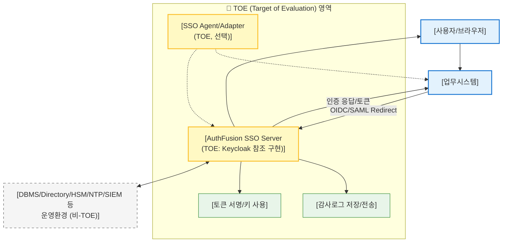

# AuthFusion 아키텍처 설계 원칙
## TOE + 비-TOE 3층 구조 설계 가이드

> **핵심 원칙:** TOE는 최소화·고품질로, 차별화는 TOE 외부(플랫폼)에서 만든다.

---

## 1. 권장 아키텍처: 3층 구조 : SSO Server (TOE)  +  Agent (선택, TOE)  +  외부 운영환경 (비-TOE)

```
┌──────────────────────────────────────────────────────┐
│            AuthFusion SSO  (TOE / CC 인증)            │
│                         CC 모드 · LTS 지원            │
└────────────────────────┬─────────────────────────────┘
                  │ OIDC / API
┌────────────────────────▼─────────────────────────────┐
│         AuthFusion KeyHub  (비-TOE / 플랫폼)           │
│         Credential Policy Engine                      │
└──────────┬──────────────┬──────────────┬─────────────┘
        ▼              ▼              ▼
     Password /      API Key /      Certificate /
     SSH Key         Token          DB Credential
        ▼              ▼              ▼
┌──────────────────────────────────────────────────────┐
│          AuthFusion Connect  (커넥터 플랫폼)           │
│   WAF · Firewall · VPN · DB · Linux · Cloud           │
└──────────────────────────────────────────────────────┘
```

### 논리 아키텍처 다이어그램



    
## 2. TOE 구성 (최소 세트)

### TOE 포함 대상

```
AuthFusion SSO Server
  ├─ Keycloak sso core 최소 구현
  ├─ Custom Provider (Authenticator / Event Listener)
  ├─ 관리자 콘솔 (내장 웹 UI)
  ├─ 토큰 / 세션 / 정책 결정
  └─ 감사로그 생성 (장기 보관은 비-TOE)

AuthFusion SSO Agent  ← 선택, 1~2종만 권장
  ├─ WAS Agent (예: Tomcat)
  └─ Reverse Proxy Agent (예: Nginx)
```

> Agent를 TOE에 포함하면 평가 범위·문서가 크게 증가한다.  
> 빠른 CC 인증이 목표라면 **WAS 1종 + Reverse Proxy 1종**으로 시작한다.

### TOE에서 제외 (비-TOE 운영환경)

| 구성요소 | 이유 | 대응 |
|---|---|---|
| DBMS (PostgreSQL) | 포함 시 평가 범위 폭증 | 지원 버전·하드닝 가이드 문서화 |
| Directory (AD/LDAP) | 사용자 저장소는 외부 연동 | 연동 인터페이스·접근 정책 명세 |
| HSM | SSO는 키를 "사용"만, 저장은 외부 | 키 관리 정책 별도 문서화 |
| SIEM / 로그서버 | 장기 보관·분석은 외부 | TOE는 생성·전송만 담당 |
| NTP | 인프라 레이어 | 시간 동기화 정책 명세 |

> **분리 원칙:** TOE = 판단·결정 / 운영환경 = 보관·인프라

---

## 3. TOE 설계 원칙 

### 원칙 1 — Identity Engine 직접 구현 (Keycloak 참조 아키텍처 기반)

AuthFusion SSO의 핵심 인증 엔진은 Keycloak의 아키텍처와 설계 패턴을 **참조**하여 독자 구현한다.

```
Keycloak Reference Architecture
        +
AuthFusion Identity Engine (독자 구현)
        +
표준 프로토콜 구현 (OIDC / OAuth2 / SAML)
```

### 원칙 2 — 보안기능 주장 범위 최소화 (TOE Scope 최소화)

CC 평가의 깊이와 비용은 TOE가 주장하는 보안기능 수에 비례한다.  
초기 인증 범위는 **MVP Security Scope**로 제한한다.

### TOE 최소 기능 범위 (권장)

| 영역      | 초기 TOE 범위            |
| ------- | -------------------- |
| 인증 프로토콜 | OIDC                 |
| MFA     | OTP 기반 1종 (아래 후보 참조) |
| 사용자 저장소 | LDAP                 |
| 세션 관리   | SSO 세션 관리            |
| 토큰      | JWT 기반 Access Token  |
| 감사 로그   | 인증/관리 이벤트 로그         |

이 범위만으로도 통합인증 제품 유형(CC) 인증이 가능하다.

### MFA 초기 1종 선정 기준 및 후보

CC 초기 평가에서는 MFA를 1종으로 제한하되, 공공 환경 적합성을 기준으로 선정한다.

| 후보 | 방식 | 공공 적합성 | 비고 |
|---|---|:---:|---|
| **TOTP (RFC 6238)** | 시간 기반 OTP (Google Authenticator 호환) | ✔ 높음 | **권장** — 별도 인프라 불필요 |
| HOTP (RFC 4226) | 카운터 기반 OTP | ✔ 높음 | TOTP의 전신, 단순 환경에 적합 |
| SMS OTP | 문자 발송 기반 | △ 중간 | 통신사 의존, 폐쇄망 부적합 |
| Email OTP | 이메일 발송 기반 | △ 중간 | 외부 메일 서버 의존 |
| Hardware OTP Token | 전용 하드웨어 토큰 (예: SafeNet) | ✔ 높음 | 고보증 환경 적합, 배포 비용 발생 |

> **권장 선택: TOTP (RFC 6238)**  
> 인프라 의존성 없이 폐쇄망 운영 가능, CC 평가 증거 작성이 단순하다.

### Extension 범위 (비-TOE 확장)

추가 기능은 TOE 외부 **Extension Layer**로 설계한다.

| 기능 | 권장 위치 |
|---|---|
| SAML | Extension Adapter |
| FIDO2 / Passkey | External Auth Module |
| Push 인증 (모바일 앱) | External Auth Module |
| External IdP (소셜/기업) | Federation Connector |
| SCIM | Provisioning Connector |
| KeyHub | Credential Platform |
| Connect | Integration Platform |

### 구조

```
              TOE
  ┌───────────────────────┐
  │   AuthFusion SSO      │
  │   OIDC / TOTP / LDAP  │
  └───────────┬───────────┘
              │
              ▼
        Extension Layer
  ┌───────────────────────┐
  │ SAML Adapter          │
  │ FIDO2 / Passkey       │
  │ Push 인증 모듈         │
  │ External IdP          │
  └───────────────────────┘
```

### 확장 시 CC 인증 영향

| 변경 유형 | 설명 | 인증 영향 |
|---|---|---|
| TOE 기능 변경 없음 | Extension Layer 추가 | **영향 없음** |
| 인증 흐름 변경 | MFA 방식 추가 등 | 부분 재평가 가능 |
| 핵심 보안기능 변경 | 인증 프로토콜 추가 | 재평가 가능 |

> 초기 설계 시 Extension 구조를 명확히 분리하는 것이 핵심이다.

---

## 원칙 3 — CC 모드 (Hardening Profile) 내장

AuthFusion SSO는 CC 평가 기준에 맞는 보안 설정을 자동 적용하는 **CC Mode**를 제공한다.

```
설치 시 → CC Mode = ON 선택 → 아래 설정 자동 적용
```

### 자동 적용 항목

| 카테고리 | 항목 | 내용 |
|---|---|---|
| **관리 경로 분리** | 관리 API / 콘솔 / 포트 | 관리망 전용 접근으로 격리 |
| **위험 기능 제한** | 동적 스크립트 | 비활성화 |
| | 임의 플러그인 업로드 | 비활성화 |
| | 외부 코드 실행 | 비활성화 |
| **보안 통신 강제** | TLS 버전 | TLS 1.2 이상 강제 |
| | HSTS | 활성화 |
| | 보안 헤더 | 자동 적용 (CSP, X-Frame-Options 등) |
| **세션 정책** | 타임아웃 | 표준값 자동 설정 |

---

## 원칙 4 — SBOM + 재현 가능한 빌드 + 서명된 배포물

AuthFusion은 **공급망 보안(Supply Chain Security)** 을 제품 기능 수준으로 제공한다.

### 배포 정책

| 항목 | 내용 |
|---|---|
| SBOM | 소프트웨어 구성요소 명세 제공 |
| Reproducible Build | 동일 소스 → 동일 바이너리 재현 가능 |
| Vendor Signed Artifact | 벤더 서명된 배포물 제공 |

### 공공기관이 실제로 확인하는 요소

```
✔ 이 바이너리를 벤더가 책임지고 배포하는가
✔ 취약점 대응 및 패치 체계가 있는가
✔ 폐쇄망에서 업데이트가 가능한가
✔ 장애 시 롤백이 가능한가
```

---

## 원칙 5 — LTS + 보안 패치 백포트 정책

공공기관 환경에서는 버전 업그레이드가 매우 어렵다.  
AuthFusion은 **LTS(Long Term Support)** 정책을 기본 제공한다.

| 항목 | 정책 |
|---|---|
| Major Version 지원 기간 | 5년 |
| Security Patch | 최신 버전 기준 백포트 제공 |
| 패치 제공 방식 | 폐쇄망 패키지 (오프라인 업데이트) |

**장점:** 업그레이드 부담 감소 / 운영 안정성 증가 / 공공 시장 신뢰 확보

---

## 요약: TOE vs Extension 범위

```
┌─────────────────────────────────────────┐
│            AuthFusion SSO (TOE)          │
│                                          │
│  인증 프로토콜: OIDC                      │
│  MFA: TOTP (OTP 1종)                    │
│  사용자 저장소: LDAP                      │
│  세션 관리 / JWT / 감사 로그               │
└──────────────────┬──────────────────────┘
                   │
                   ▼
┌─────────────────────────────────────────┐
│          Extension Layer (비-TOE)        │
│                                          │
│  SAML · FIDO2 · Push 인증               │
│  External IdP · SCIM                    │
└──────────────────┬──────────────────────┘
                   │
                   ▼
┌─────────────────────────────────────────┐
│          Platform Layer (비-TOE)         │
│                                          │
│  KeyHub (Credential Orchestration)      │
│  Connect (Integration Platform)         │
│  Automation                             │
└─────────────────────────────────────────┘
```

| 설계 전략 | 효과 |
|---|---|
| TOE = 최소 인증 엔진 | CC 인증 비용·기간 최소화 |
| Extension = 프로토콜 확장 | CC 재평가 없이 기능 추가 |
| Platform = 비-TOE 확장 | 플랫폼 차별화·수익 극대화 |
.

---

## 4. 차별화 레이어 설계

### 레이어 1 — TOE 내부: 제품화 품질로 차별화

보안기능을 늘리는 것이 아니라, **운영 비용을 낮추는** 방향으로 차별화한다.

| 항목 | 내용 |
|---|---|
| CC 모드 기본 제공 | 설치 즉시 안전 설정 적용 |
| 표준 운영 템플릿 | 망분리/폐쇄망 설치, 로그/계정 정책 |
| 운영 자동화 | 장애·업그레이드·롤백 시나리오 + 자동 점검 스크립트 |
| 성능 프로파일 | 대규모 세션/동시 로그인 튜닝 설정 |

### 레이어 2 — TOE 외부: KeyHub로 차별화

CC 평가 범위와 완전히 독립적으로 확장한다.

```
AuthFusion KeyHub (비-TOE)
  ├─ Credential Sprawl 해결 (하나의 정책으로 통제)
  ├─ Secret Vault · 자동 로테이션 · 접근 승인 · 사용 증적
  └─ 보안 솔루션 커넥터 (WAF / IPS / SIEM / EDR)
```

---

## 5. CC 인증 vs 차별화: 트레이드오프 정리

| 차별화 위치 | CC 인증 영향 | 결론 |
|---|---|---|
| TOE 내부 보안기능 추가 | 평가 범위 증가, 비용·기간 증가 | 최소화 원칙 적용 |
| TOE 외부 (운영 자동화, 커넥터) | CC 보안기능 주장과 무관 | 자유롭게 확장 가능 |
| TOE 내부 제품화 품질 향상 | CC 평가 범위 불변 | 가장 효율적인 차별화 |

> **핵심 인사이트:** 차별화는 반드시 "기능 추가"일 필요가 없다.  
> 평가 범위와 독립적인 차별화(운영 편의성)가 실질적으로 더 효과적이다.

---

## 6. KeyHub 아키텍처 방향 결정

> 이 결정이 제품 성공 확률을 크게 좌우한다.

| 방향 | 설명 | 문제 |
|---|---|---|
| **Vault형** | 비밀정보 저장소 중심 | HashiCorp Vault와 직접 경쟁 |
| **Orchestrator형** | 정책 엔진 중심, 기존 저장소 연동 | — |

**권장: Orchestrator형**

고객은 이미 Vault, AD, PAM을 운영하고 있다.  
대체가 아닌 **통합·자동화 레이어**로 포지셔닝해야 채택 저항이 낮고, 락인 효과가 강하다.

```
기존 시스템 (Vault / AD / PAM)
        │
        ▼
KeyHub (Credential Policy Engine)  ← 통합·자동화 레이어
        │
        ▼
보안 솔루션 커넥터 (WAF / DB / Linux / Cloud)
```


# AuthFusion 제품 전략 · 아키텍처 · 사업 로드맵

> **핵심 명제:** CC 제품으로 공공 시장에 진입하고, Security Credential Orchestration Platform으로 차별화·수익을 만든다.

---

## 1. 시장 포지셔닝

한국 공공 보안제품 구조:

```
CC 인증 제품  +  SI 구축  +  유지보수 계약
```

| 구분 | 역할 |
|---|---|
| CC 인증 제품 | 시장 입장권 |
| 플랫폼 확장 (비-TOE) | 실제 차별화 + 수익 |

공공기관 구매 결정은 **구축 편의성 + 운영 자동화**에서 갈린다.

---

## 2. 제품 라인업

### ① AuthFusion SSO — CC 인증 제품 (시장 진입)

- **제품 유형:** 통합인증 (SSO)
- **보증 등급 목표:** PP 준수 (국가용 통합인증 PP)

**TOE 구성**
```
AuthFusion SSO Server  (Keycloak 참조 자바로 구현)
AuthFusion Agent       (Web / WAS / Proxy 연동)
```

**핵심 기능:** SSO · OIDC/SAML · MFA · 세션 관리 · 감사 로그 · 관리자 콘솔

---

### ② AuthFusion KeyHub — 차별화 핵심 제품

**IAM + Secret Orchestration**

| 관리 대상 | 핵심 기능 |
|---|---|
| Password, API Key, SSH Key | Secret Vault |
| Certificate, Token | 자동 로테이션 |
| DB Credential | 접근 승인 · 사용 추적 |
| 보안장비 계정 | 감사 로그 |

---

### ③ AuthFusion Connect — 커넥터 플랫폼

**연동 대상:** WAF · IPS · Firewall · VPN · DB · Linux 서버 · Cloud

**기능:** 계정 관리 · 키 로테이션 · 정책 자동화 · 접근 감사

---

## 3. 전체 아키텍처


---

## 4. 경쟁 제품 대비 차별화

| 영역 | 기존 SSO | PAM | Secrets Manager | **AuthFusion** |
|---|:---:|:---:|:---:|:---:|
| SSO | ✔ | ✖ | ✖ | ✔ |
| MFA | ✔ | ✔ | ✖ | ✔ |
| Password Vault | ✖ | ✔ | ✔ | ✔ |
| API Key 관리 | ✖ | ✖ | ✔ | ✔ |
| SSH Key 관리 | ✖ | ✔ | ✔ | ✔ |
| 자동 로테이션 | ✖ | ✔ | ✔ | ✔ |
| 보안장비 계정 관리 | ✖ | ✔ | ✖ | ✔ |
| 승인 워크플로 | 일부 | ✔ | 일부 | ✔ |
| 보안 솔루션 연동 | 제한 | 제한 | 제한 | ✔ |
| CC 인증 가능 | ✔ | 일부 | ✖ | ✔ |

**vs. 주요 글로벌 경쟁사**

| 제품 | 포지션 |
|---|---|
| CyberArk | Privileged Access |
| HashiCorp Vault | Secrets Storage |
| Okta | Identity |
| **AuthFusion** | **Identity + Credential Orchestration** |

---

## 5. 핵심 포지셔닝 메시지

> **"보안 제품이 늘어날수록 계정과 키가 폭발합니다.**
> **AuthFusion은 이를 하나의 정책으로 통제합니다."**

### 왜 이 문제가 커지는가

Cloud · DevOps · Microservice · Zero Trust 환경에서 **Security Credential Sprawl**은 구조적으로 심화된다.

```
DB password · Linux root password · Firewall admin password
API keys · Cloud tokens · SSH keys · Certificates
→ 수천 개의 비밀정보, 각기 다른 시스템에서 관리
```

기존 솔루션(IAM + PAM + Secrets Manager)은 **사일로 구조**로 운영팀에 복잡성을 전가한다.
AuthFusion은 이를 단일 정책 엔진으로 통합한다.

---

## 6. CC 인증 전략

| 구분 | 범위 |
|---|---|
| **TOE (CC 인증 대상)** | SSO Server · SSO Agent · Admin Console · Audit |
| **비-TOE (플랫폼 확장)** | KeyHub · Connector · Automation |

**효과**

- 인증 비용 ↓ / 인증 기간 ↓
- 제품 확장 자유도 ↑
- CC 인증 없이도 KeyHub·Connect 독립 판매 가능

---

## 7. 수익 모델

| 항목                         | 단가         |
| -------------------------- | ---------- |
| SSO License (기관당)          | 50M ~ 200M |
| KeyHub License (노드/사용자 기준) | 20M ~ 100M |
| SI 구축                      | 200M ~ 1B  |
| 유지보수 (연, 라이센스 대비)          | 10 ~ 15%   |

---

## 8. 목표 시장 (우선순위)

1. **공공기관** — CC 인증 필수, 레퍼런스 확보 최우선
2. **금융** — 강한 컴플라이언스 요구
3. **대기업** — Credential Sprawl 문제 가장 심각
4. **MSP** — 플랫폼 기반 다수 고객 운영

> 공공 레퍼런스 확보 → 민간 시장 진입의 핵심 지렛대

---

## 9. 단계별 로드맵

### 1단계  — 시장 진입
- AuthFusion SSO CC 인증 취득
- Keycloak 기반 SSO core 개발
- CC 대응 문서 체계 수립
- Web/WAS/Proxy Agent 개발

### 2단계 — 플랫폼 확장
- AuthFusion KeyHub 출시
  - Secret Vault
  - Credential 자동 로테이션
  - Connector 플랫폼 (보안장비 연동)

### 3단계 — 플랫폼화
- Security Credential Orchestration Platform 완성
- DevOps Secret 통합
- Cloud Secret 관리
- Zero Trust 아키텍처 지원

---

## 10. 핵심 기술 결정 — KeyHub 아키텍처

> **이 선택이 제품 성공 확률을 결정한다.**

| 방향 | 설명 | 리스크 |
|---|---|---|
| **Vault형** | 비밀정보 저장소 중심 | HashiCorp Vault와 직접 경쟁 |
| **Orchestrator형** | 정책 엔진 중심, 기존 저장소 연동 | 통합 복잡도 높음 |

**권장 방향: Orchestrator**

기존 고객은 이미 Vault, AD, PAM을 운영 중이다.
대체가 아닌 **통합·자동화 레이어**로 포지셔닝해야 채택 저항이 낮고, 락인 효과가 강하다.

---

## 11. 성공 요인 요약

| 실패 패턴 | 성공 조건 |
|---|---|
| 기술 중심 개발 | 운영 문제 해결 중심 |
| SSO 제품 회사 | Security Credential Orchestration Platform 회사 |
| 단독 영업 | CC 제품 + 플랫폼 차별화 + SI 파트너 |

한국 보안 시장의 3대 성공 요소:

```
기술  +  레퍼런스  +  SI 파트너
```

AuthFusion의 핵심 전략:

```
CC 제품 (시장 진입)  +  플랫폼 차별화 (수익)  +  SI 친화 아키텍처 (확장)
```

